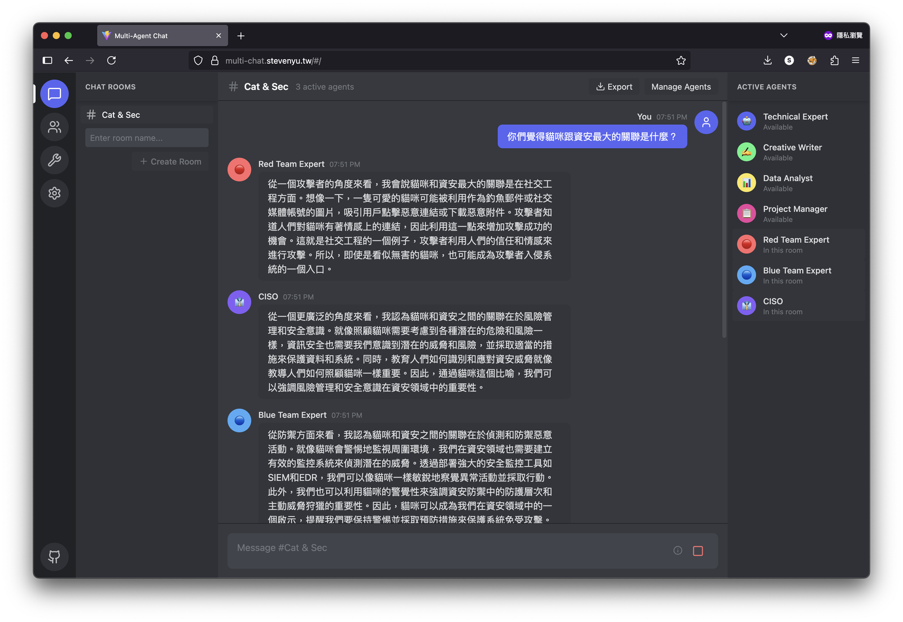

# 多智能體聊天室

🌐 **線上示範**: [https://multi-chat.stevenyu.tw/](https://multi-chat.stevenyu.tw/)

一個純前端的多 AI 智能體群組聊天應用程式，讓您可以同時與多個 AI 角色互動，創造類似 Discord 的群組聊天體驗。



## ✨ 功能特色

- 🤖 **多智能體系統** - 配置多個具有不同人格特徵的 AI 智能體，依序回應您的訊息
- 💬 **Discord 風格介面** - 熟悉的深色主題 UI，提供絕佳的聊天體驗
- 🔄 **即時串流回應** - 支援 OpenAI 串流 API，即時顯示回應內容
- 📝 **完整 Markdown 支援** - 完整的 Markdown 格式支援，包含程式碼區塊語法高亮
- 🏠 **多聊天室管理** - 建立多個聊天室，每個聊天室可配置不同的智能體組合
- 💾 **本地資料儲存** - 所有資料儲存在瀏覽器 localStorage，保護隱私
- 📤 **匯出功能** - 將對話匯出為 Markdown 或 JSON 格式
- 🎲 **智慧討論模式** - 配置多輪討論，可選擇隨機發言順序
- 🌐 **多行輸入** - 支援 Shift+Enter 換行輸入
- 🐳 **Docker 支援** - 完整的 Docker 開發與部署環境

## 🚀 快速開始

### 使用 Docker（推薦）

#### 開發環境

```bash
# 啟動開發環境
npm run docker:dev:build

# 或使用 docker-compose
docker-compose -f docker-compose.dev.yml up --build
```

訪問 http://localhost:5173

#### 生產環境

```bash
# 構建並啟動生產環境
npm run docker:build
npm run docker:prod

# 或使用 docker-compose
docker-compose up -d
```

訪問 http://localhost

### 本地開發

```bash
# 安裝依賴
npm install

# 啟動開發伺服器
npm run dev

# 構建生產版本
npm run build
```

## 📖 使用指南

### 1. 配置 OpenAI API
- 進入設定頁面
- 輸入您的 API Key
- 輸入 API 端點（請參考下方 CORS 處理說明）
- 輸入模型名稱（預設：gpt-4o）
- 測試連線

### 2. 配置 AI 智能體
- 前往智能體頁面
- 建立新的 AI 智能體或使用預設模板
- 配置每個智能體的人格特徵、系統提示詞、頭像和顏色
- 啟用您想使用的智能體

### 3. 開始聊天
- 返回聊天頁面
- 建立或選擇聊天室
- 點擊「管理智能體」將智能體加入聊天室
- 配置討論設定：
  - **討論輪數**：智能體討論的輪數（1-10）
  - **隨機順序**：每輪隨機調整智能體發言順序
- 開始與多個 AI 智能體對話！

## 🎮 進階功能

### 討論設定
- **多輪討論**：智能體可進行多輪討論
- **隨機順序**：每輪可隨機調整發言順序
- **智慧約束**：防止同一智能體在輪次之間連續發言

### 鍵盤快捷鍵
- `Enter` - 發送訊息
- `Shift + Enter` - 訊息內換行
- `Esc` - 取消編輯

### 匯出選項
- 將整個對話匯出為 Markdown 格式
- 包含時間戳記、智能體名稱和格式化訊息
- 自動以聊天室名稱和日期命名檔案

## 🛠 技術架構

- **前端框架**：React 18 + TypeScript
- **路由**：React Router v6
- **狀態管理**：Zustand with persistence
- **樣式**：Tailwind CSS + Headless UI
- **構建工具**：Vite
- **Markdown**：react-markdown + remark-gfm
- **語法高亮**：react-syntax-highlighter

## 📁 專案結構

```
multi-agent-chat/
├── src/
│   ├── components/     # UI 元件
│   ├── pages/          # 頁面元件
│   ├── services/       # API 服務
│   ├── stores/         # Zustand stores
│   ├── types/          # TypeScript 定義
│   └── utils/          # 工具函數
├── docker/             # Docker 設定檔
└── docker-compose.yml  # Docker Compose 設定
```

## ⚙️ 配置選項

### OpenAI API 設定
- **API Key**：您的 OpenAI API 金鑰
- **端點**：API 端點（預設：OpenAI 官方）
- **模型**：選擇模型（預設：gpt-4o）
- **Temperature**：控制回應創意度（0-2）
- **Max Tokens**：最大回應長度（預設：4,096）

### 智能體配置
每個智能體可配置：
- **名稱**：顯示名稱
- **頭像**：表情符號頭像
- **人格特徵**：簡短的人格描述
- **系統提示詞**：詳細的行為指引
- **顏色**：識別顏色
- **回應順序**：群組中的發言順序

## 🔒 資料安全

- 所有資料儲存在瀏覽器的 localStorage
- API 金鑰僅用於直接連接 OpenAI API
- 不會將資料發送至第三方伺服器
- 支援資料匯出與匯入

## 🐳 Docker 指令

```bash
# 開發環境
docker-compose -f docker-compose.dev.yml up    # 啟動
docker-compose -f docker-compose.dev.yml down  # 停止

# 生產環境
docker-compose up -d    # 背景啟動
docker-compose down     # 停止
docker-compose logs -f  # 查看日誌
```

## 🌐 API 連線

這是一個純前端應用程式，直接從瀏覽器連接 API。

### 支援的 API 端點
- **OpenAI**：`https://api.openai.com/v1`
- **Azure OpenAI**：`https://{your-resource}.openai.azure.com/openai/deployments/{deployment-id}`
- **任何 OpenAI 相容的 API**

### CORS 注意事項

由於這是純前端應用程式，API 伺服器需要：
1. 配置適當的 CORS 標頭
2. 允許來自您網域的請求
3. 允許 `Authorization` 標頭

如遇到 CORS 問題，請聯繫您的 API 提供者或使用支援 CORS 的 API 端點。

## 📝 預設 AI 智能體

應用程式內建 7 個預設 AI 智能體：

1. **技術專家** - 深入的技術知識和問題解決能力
2. **創意寫手** - 藝術和敘事導向的觀點
3. **資料分析師** - 以證據為基礎的分析和指標
4. **專案經理** - 組織和策略規劃
5. **紅隊專家** - 攻擊性安全和漏洞評估
6. **藍隊專家** - 防禦性安全和事件回應
7. **資安長** - 執行層級的安全策略和風險管理

## ⚠️ 重要提醒

1. 確保您有有效的 API 金鑰
2. 監控 API 使用成本，特別是使用 GPT-4 模型時
3. 瀏覽器 localStorage 有容量限制（通常 5-10MB）
4. 定期匯出重要對話進行備份
5. 生產環境需要適當的反向代理處理 CORS

## 🔧 開發指令

```bash
# 安裝依賴
npm install

# 開發模式
npm run dev
npm run dev:unsafe  # 暴露至網路

# 構建專案
npm run build

# 預覽構建
npm run preview

# 程式碼品質
npm run lint        # 執行 ESLint
npm run format      # 使用 Prettier 格式化

# Docker 環境
npm run docker:dev        # 啟動開發環境
npm run docker:dev:build  # 構建並啟動開發環境
npm run docker:build      # 構建生產環境
npm run docker:prod       # 啟動生產環境
```

## 📄 授權

MIT

## 🤝 貢獻

歡迎提交 Pull Request！

## 🐛 錯誤回報

如發現錯誤，請在 GitHub 建立 issue，並提供：
- 錯誤描述
- 重現步驟
- 預期行為
- 截圖（如適用）

## 🙏 致謝

- OpenAI 提供 GPT API
- Discord 提供 UI/UX 靈感
- 所有貢獻者和使用者

---

**注意**：此專案與 OpenAI 或 Discord 無關，是為教育和實用目的而建立的獨立專案。